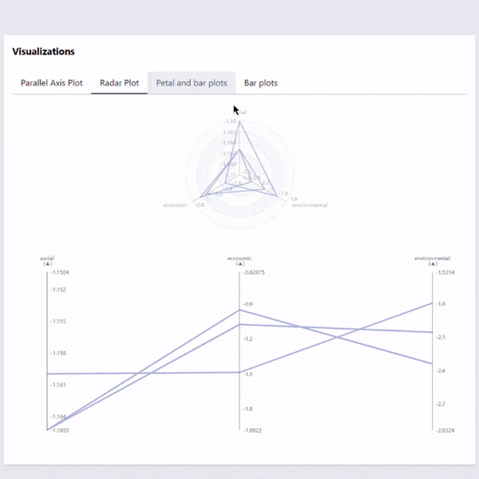

# Visual components

The visual folder contains mainly visualization components, which use Apache ECharts.js and Svelte.js libraries. ECharts handles the chart configuration and generation, Svelte is used to make them easily accessible as commponents.

## Available components (TODO: Add link to images, add rest of the available components)

### HorizontalBar.svelte

### Parallel Coordinate Plot

### Linking functionality:



## Folder structure:

### visual -folder

- Contains files that the different components use, such as constants.ts and helperFunctions.ts

#### general -folder

- Contains the EchartsComponent.svelte, which is used to create a chart and render it. This component is used in all visualization components.

#### preference-interaction -folder

- This folder contains components that are used in helping the user to select the preferred value.

#### visualization -folder

- This folder contains the visualization components. The components are divided into two subfolders.

- ##### props-linking -folder
  - Contains components that use props to link selections and highlighting with the rest of the cahrts.
  - These components don't use ECharts to link the charts, but instead use props for it.
- ##### multi-charts -folder
  - Contains components that uses ECharts to render multiple charts in one component.
  - This is achieved by using the series option in ECharts.
    - Each solution is a different series object in the series array.

## How to use the components

To add a component to your HTML, use it as a normal svelte component with props. So if you wish to add a parallel coordinate plot, first import it:

```typescript
import ParallelAxis from "$lib/components/visual/ParallelAxis.svelte";
```

Then add the HTML tag with the props:

```html
<ParallelAxis
  id="parallelAxis"
  title="Parallel Axis chart"
  data="{exampleData}"
/>
```

At the moment, the data should be given as `solutionData` type. All the DESDEO methods will give the data in this format, so it will be easy to use the data when using DESDEOs methods.

## How to make your own component

### Contributing

If you wish to contribute to the visual components, please read the general instructions from the master branch [README.md](https://github.com/industrial-optimization-group/desdeo-webui/tree/master#version-control-and-contributing)

### Step by step

0. Create a new .svelte file in the visual folder

   - Import EchartsComponent.svelte and types

     ```typescript
      <script lang="ts">
        import EchartsComponent from "$lib/components/visual/general/EchartsComponent.svelte";
        import type * as echarts from "echarts";

        const option: echarts.EChartOption = {
          title: title,
        };
        // Rest of the code here
      </script>

      <EchartsComponent {option} />

     ```

1. Creating the chart
   - Configure ECharts options, for reference use echarts own documentation: [ECharts Docs](https://echarts.apache.org/en/option.html#title)
     ```typescript
     const option: echarts.EChartOption = {
       title: title,
       //Other options...
     };
     ```
   - Then use the EchartsComponent.svelte to create the chart and pass the option as a prop.
     ```typescript
      <EchartsComponent
        {option}
        // Other (optional) props...
      />
     ```
   - If you want to use the created echart instance, you should bind it to a variable
     ```typescript
     <EchartsComponent
       {option}
       bind:chart
       // Other (optional) props...
     />
     ```
     - This will allow you to use the instance in the new component:
       ```typescript
       let chart: echarts.EChartsType;
       ```
1. Configuring the svelte component

   - Add the props that you want to use in the component

     ```typescript
     export let colors: string[];
     export let values: number[][];
     export let selectedIndices: number[] = [];
     export let highlightedIndex: number | undefined = undefined;
     export let maxSelections: number | undefined = undefined;
     export let disableAnimation = false;
     ```

   - Remember to add the component in your main svelte file:
     ```html
     <MyComponent colors="{colors}" {values} disableAnimation="{true}" />
     ```

1. Data processing TODO: Instructions are not up to date

   - When getting the data from solutionData, it usually needs to be processed somehow to create the chart's series and names dynamically.
   - For example making the series dynamically.

     ```typescript
     let seriesData: { value: number[]; name: string }[] = [];
     for (let i = 0; i < values.length; i++) {
       seriesData.push({ value: values[i], name: "Solution " + (i + 1) });
     }
     ```

     - This could be the used in the options as follows
       ```typescript
       const option: echarts.EChartOption = {
         title: title,
         //Other options...
         series: seriesdata,
       };
       ```
