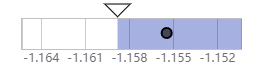
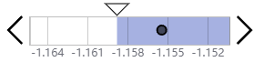
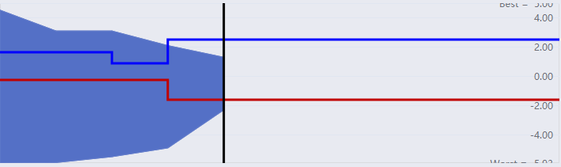
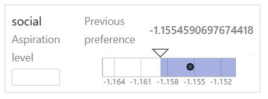
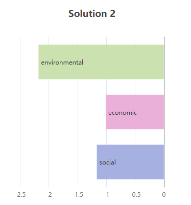
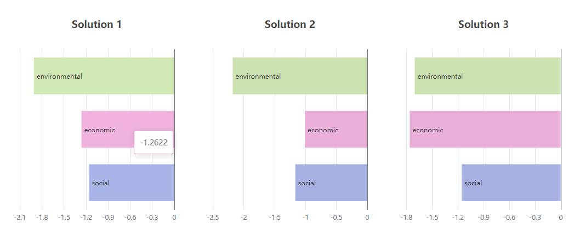
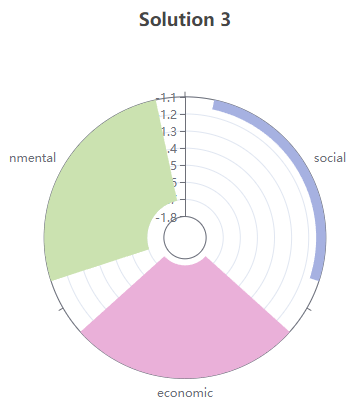
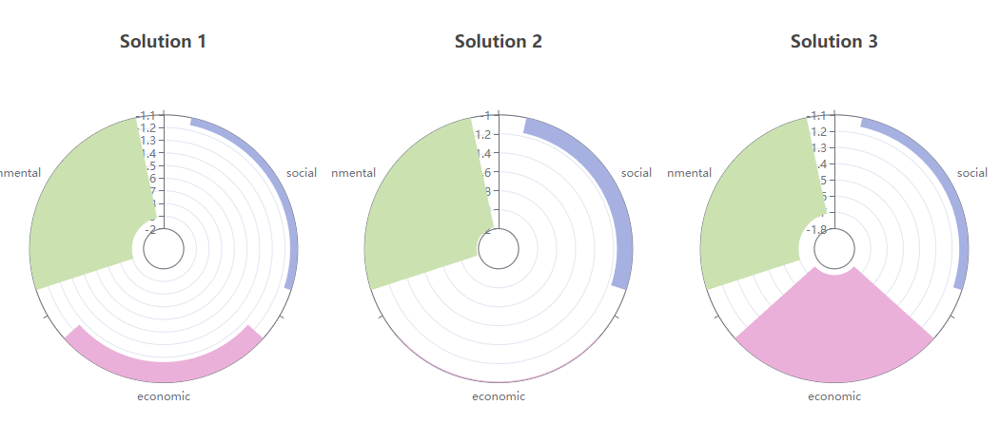
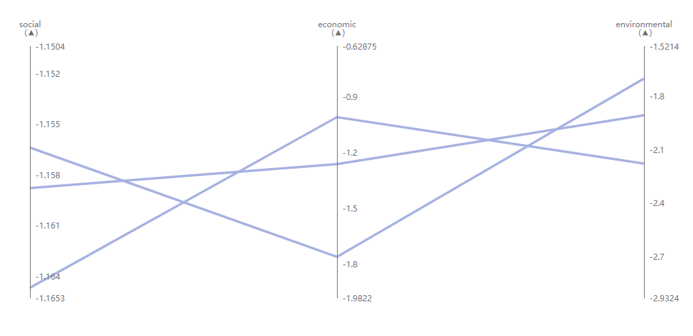

_Last update: 29.8.2023_

# Instructions for UI users

This guide presents all the visual components available and how to interact with them.

## Available components

### Horizontal Bar

This component is meant to help the user choose a preferred value in the range of the bar. The user can click on the chart and that value will be selected. The user can also drag the selection line. The arrows are there for the user to select a specific value. When hovering on a interactive button, a tooltip will appear to explain the functionality of the button.

In case of a MOO problem, the coloring of the bar indicates whether the objective is to be maximized or minimized. In a minimization problem, there is more color from right to left until the current solution value. In a maximization problem, there is more color from left to right.

- Version without arrows:

  

- Version with arrows and validation:

  

### Nautilus Navigation Bar

In this component, there is three lines that the user can interact with: the aspiration (blue) line and the bound (red) line and the step (black) line that the user can
drag to a desired value. The tooltip on hovering is also available for this component.

### Horizontal and Nautilus bars with inputs

Here, the charts have the same functionalities as mentioned above, but in addition the user can set the values by typing them in the input fields.

## Visualizations

The following components are meant to display the results of the optimization algorithm. The user interaction is limited to hovering over the lines on the charts to see the values of the alternatives, and clicking for selecting the alternative. Hovering and selecting are also linked to other visualizations, so that the user can see the values of the alternatives on all of the visualizations.

### Radar Chart

Shows all of the alternatives in a radar chart.

### Bar Chart

One bar chart shows the objective values of an alternative.

### Petal Chart

### Parallel Coordinate Plot

Here, in addition to clicking, the user can select alternatives by brushing on the axes.

